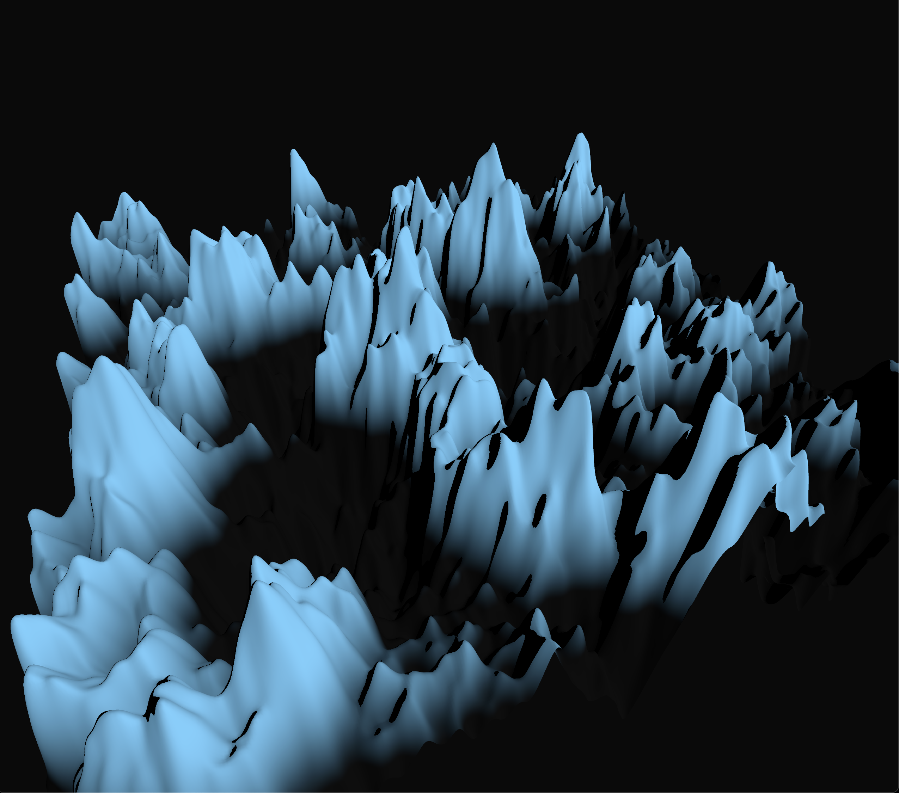

    <h1>Three Js Dirt Jam</h1>
    
    

        My submission in <a href="https://itch.io/jam/acerola-dirt-jam" target="_blank">Acerola's Dirt Jam</a> which focuses on Procedural Terrain Generation. This is a very minimal example of Procedural Terrain Generation and focuses on <b>fractional brownian motion</b> and <b>turbulence</b> noise.
    

## :sparkles: Show me what you got!
Live Demo can be found [here](https://yhutter.github.io/threejs-dirt-jam).

## :sunrise_over_mountains: Why?
For me this project was just about having fun and dipping my toes in procedural terrain generation. I also wanted an excuse to try out `TSL (Three Shading Language)`.

## :raised_hand: What can I do with it?
Well... you can play around with some sliders? Honestly there was way more I wanted to do but I just did not have the time like:
- An actual polished UI (looking at you `Tiny Glade`)
- An infinite Terrain (Exploring Quadtrees etc.)
- Fog
- Biomes
- Plants and vegetation
- ...

Well guess these are some points future me needs to take up!

## :clap: Acknowledgements
This would not have been possible without these awesome ressources/people:
- [Bruno Simon's ThreeJs Journey Course](https://threejs-journey.com/)
- [SimonDev's Shader and GameDev Course](https://simondev.io/)
- [Inigo Quillez Raymarching Terrains](https://iquilezles.org/articles/terrainmarching/)
- [Book of Shaders - Fractional Brownian Motion](https://thebookofshaders.com/13/)

